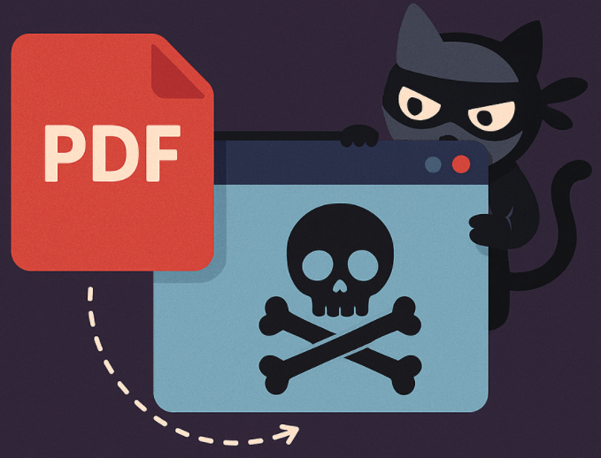

# Level 2

In the second level fake pdf converter software is installed on a worksation. It is your job to figure out what this software does and how you can detect such and other potentially malicious/unwanted applications.



Related links:
- https://www.trendmicro.com/en_us/research/25/i/evilai.html
- https://www.ncsc.nl/actueel/nieuws/2025/08/29/nieuwe-malwarecampagne-ontdekt-via-manualfinder
- https://www.truesec.com/hub/blog/tamperedchef-the-bad-pdf-editor
- https://expel.com/blog/you-dont-find-manualfinder-manualfinder-finds-you/

### Host
| DeviceName  | DeviceId |
|-------|-----|
| kustocon-level2 | 0dc945819ed7b009e2a6c943dd1008e8524734da  |


## .lnk file on desktop from AppData

<details>
<summary>Tip 1</summary>
Find the table that has the ActionType *ShellLinkCreateFileEvent* - A specially crafted link file (.lnk) was generated. The link file contains unusual attributes that might launch malicious code along with a legitimate file or application.
</details>

<details>
<summary>Tip 2</summary>
The application in installed in the AppData folder, this has its reasons. Use this information to build a detection.
</details>

<details>
<summary>Answer</summary>

```KQL
let Threshold = 1000;
DeviceEvents
| where ActionType =~ "ShellLinkCreateFileEvent"
| where FolderPath has "Desktop"
| extend ShellLinkIconPath = parse_json(AdditionalFields).ShellLinkIconPath, ShellLinkWorkingDirectory = parse_json(AdditionalFields).ShellLinkWorkingDirectory
| where ShellLinkWorkingDirectory has "AppData"
// Enrich data with FileProfile
| invoke FileProfile(InitiatingProcessSHA256, 10000)
| where GlobalPrevalence <= Threshold
```
</details>